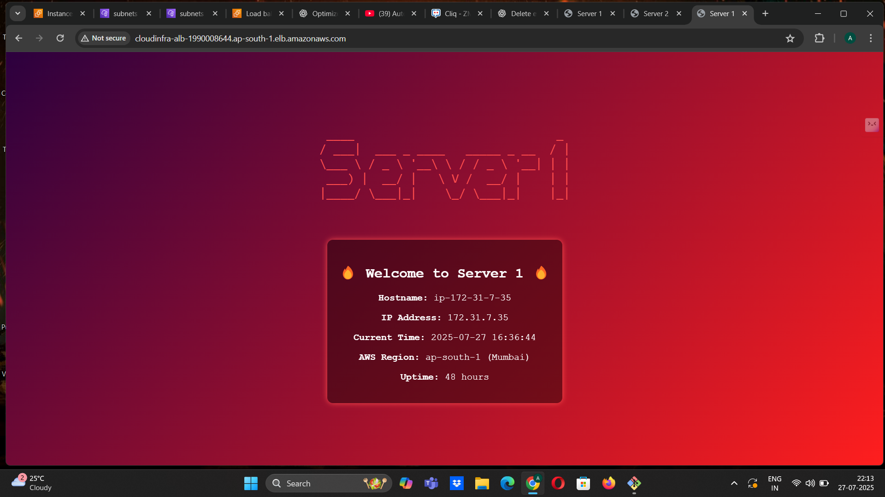
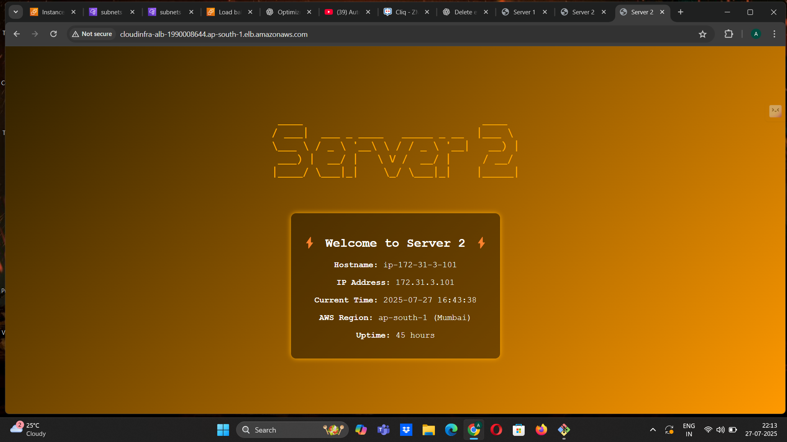
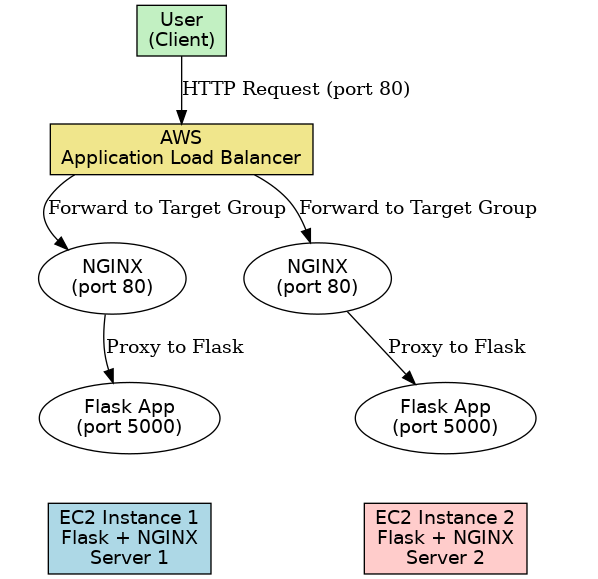

# AWS Flask App with Load Balancing using ALB & NGINX 🚀

This project showcases a Flask application deployed on **two EC2 instances** behind an **AWS Application Load Balancer (ALB)**, with **NGINX as a reverse proxy**, and systemd services managing the app. This setup demonstrates basic high availability and network infrastructure deployment using AWS, Linux, and Python.

---

## 🛠️ Tech Stack

- **Flask** (Python Backend)
- **NGINX** (Reverse Proxy Server)
- **AWS EC2** (Two Ubuntu 22.04 Instances)
- **AWS ALB** (Application Load Balancer for traffic distribution)
- **Systemd** (To run Flask app as a service)
- **Linux Networking + SSH + Git Bash**
- **HTML + PyFiglet** (for dynamic & styled UI)

---

## 📸 Screenshots

| EC2 Server 1 Output | EC2 Server 2 Output |
|---------------------|---------------------|
|  |  |

> These show the Flask apps running independently with unique themes and content. ALB switches traffic between both.

---

## 📊 Project Architecture



---

## ⚙️ How It Works

- Two EC2 Ubuntu servers run Flask apps on port `5000`.
- NGINX listens on port `80` and reverse proxies requests to Flask.
- Flask apps show styled server info (IP, hostname, time).
- AWS ALB distributes traffic to both EC2s based on health checks.
- Flask apps are managed using `systemd` services for uptime.
- Fully load-balanced and fault-tolerant.

---

## 🔧 Commands Used

**Flask + Venv Setup:**

```bash
sudo apt update && sudo apt install python3-pip python3-venv nginx -y
python3 -m venv venv
source venv/bin/activate
pip install flask pyfiglet
